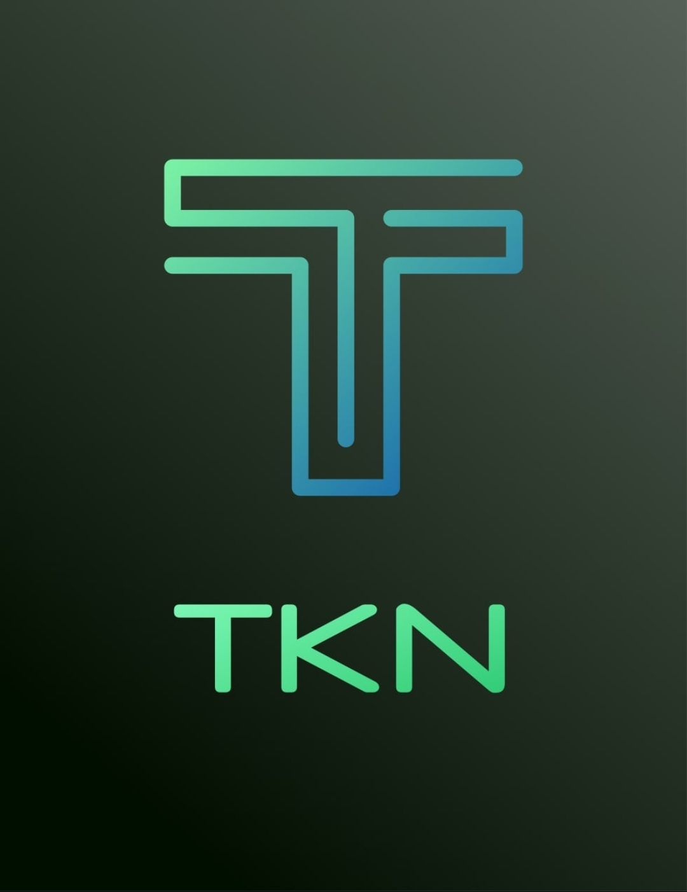

# VAULT ON THE BLOCKCHAIN
## INTRODUCTION
As the name implies, this project introduces the use of the Blockchain technology in securing
various file assets with the integration of a decentralized file storage system called [InterPlanetary
File System(IPFS)](https://ipfs.io).

The IPFS is a protocol and peer-to-peer network for storing and sharing data in a distributed file
system. It uses content-addressing to uniquely identify each file in a global namespace
connecting all nodes. This system enables users to host and receive contents.

As we know, the Blockchain technology is almost unhackable ensuring the security of assets
entrusted to it. This feature enables several security implementation using this technology.
The Vault On The Blockchain project appreciates this special security feature of the Blockchain
to develop an innovative secured file storage system. This ensures the safety of our file assets at
minimal cost effect.

## OBJECTIVE
This objective of this project is to create a platform for maximum security of file assets in a
decentralized manner. This system ensures safety of stored files at minimal cost.

## FUNCTIONALITY
This user of this project’s platform will be able to store any file asset in the system. This file
asset could be retrieved at any time by the user. The user can assign delegates that can have
access to the said file asset after a particular set date by the user. This process ensures maximum
security of the stored files at minimal cost.

## CODEBASE
This project consists of both the frontend and the backend. The backend is written in Solidity
programming language while the frontend was written in HTML, CSS, and Javascript with the
integration of Web3.js framework for interaction with the Solidity backend.

## CODEBASE IN DETAIL
The platform has a file input, a date-time input, and three text input options. The file input is
required while other input fields are optional.
The backend codebase has several public functions for functionalities. They are:
```
uploadFile
myFile
myFilesLength
myFileName
myFileDelegate
myFileDelegatesLength
myDelegatedFile
myDelegatedFilesLength
fileUploader
isFileDownloadable
```

- The `uploadFile` function is responsible for submitting the generated file-hash (from IPFS) to
the Blockchain. It accepts arguments such as the file-hash. 
- the `file-name` array of delegate
addresses, and the download time in UTC. It returns a Boolean value of true (for successful) or
false (or failed transaction).
- The `myFile` function accepts a number as an index value and returns the corresponding file-
hash for a particular address
- The `myFilesLength` returns the total number file-hashes uploaded by the calling address.
- The file-hashes represent the files uploaded.
- The `myFileName` function receives a file-hash as an argument and returns the corresponding file-name of the file-hash.
- The `myFileDelegate` function receives file-hash and an index number to provide the delegate
assigned at the index position for that particular file-hash.
- The `myFileDelegatesLength` accepts a particular file-hash and returns the total number of
delegates assigned to that particular file.
- The “myDelegatedFile” takes an index parameter and the file-hash that the address is delegated
to at that index.
- The `myDelegatedFileLength` function gives the total number of files the address is delegated
to.
- The `fileUploader` function is responsible for returning the uploader address of a particular file.
It takes the file-hash as an argument.
- The `isFileDownloadable` function is a logic check if a file’s download time is due. It takes file-
hash as argument. This function is ONLY applied to file delegates. The uploader of a file is not
restricted to the file access
